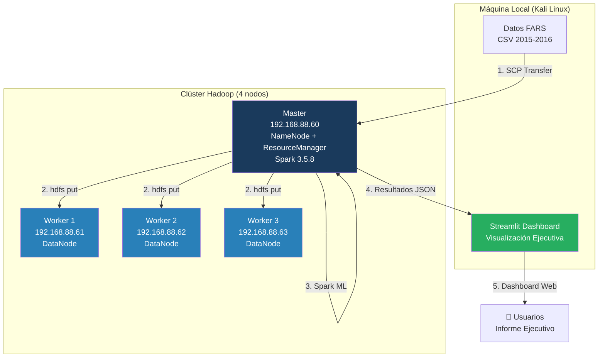
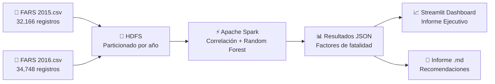

# 🚗 CASO DE ESTUDIO: Análisis de Factores de Fatalidad en Accidentes de Tráfico (FARS)

**Big Data & Machine Learning con Hadoop + Spark + Streamlit**

> 📂 **Repositorio:** [github.com/Triluxxx/big_data](https://github.com/Triluxxx/big_data)  
> 📖 **Documentos complementarios:** [README.md](README.md) | [COMANDOS.md](COMANDOS.md) | [procedimiento_hadoop_fars.md](procedimiento_hadoop_fars.md)

---

## 📋 1. RESUMEN EJECUTIVO

### Rol Asumido

**Científico de Datos / Ingeniero de Big Data** en una consultora de seguridad vial contratada por una aseguradora nacional. El objetivo es identificar los factores que más incrementan la letalidad en accidentes de tráfico para fundamentar políticas de prevención y ajustar primas de seguro basadas en datos.

### Dataset

### Hallazgo Principal

> **El alcohol tiene un efecto multiplicador:** un accidente con 3 conductores ebrios es **70% más letal** que uno sin alcohol (1.83 vs 1.08 fatalidades/accidente).

---

## 🏗️ 2. ARQUITECTURA DEL PIPELINE

### 2.1 Diagrama de Infraestructura



### 2.2 Flujo de Datos



### 2.3 Stack Tecnológico

| Capa | Tecnología | Versión | Propósito |
|------|-----------|---------|-----------|
| **Almacenamiento** | Hadoop HDFS | 3.3.6 | Sistema de archivos distribuido |
| **Procesamiento** | Apache Spark | 3.5.8 | Análisis ML distribuido |
| **Lenguaje** | Python (PySpark) | 3.13 | Scripts de análisis |
| **ML** | Spark MLlib | 3.5.8 | Random Forest Regressor |
| **Visualización** | Streamlit | 1.58 | Dashboard interactivo |
| **Gráficos** | Matplotlib | 3.11 | Generación de charts |
| **Datos** | Pandas | 3.0 | Manipulación de datos |
| **Túnel** | Localtunnel | - | Exposición pública |

---

## 🔧 3. PROCEDIMIENTO COMPLETO

### 3.1 FASE 1: Descubrimiento y Diagnóstico del Clúster

**Objetivo:** Identificar los nodos del clúster Hadoop y verificar su estado.

```bash
# Verificar conectividad a los 4 nodos
ping -c 1 192.168.88.60   # Master
ping -c 1 192.168.88.61   # Worker 1
ping -c 1 192.168.88.62   # Worker 2
ping -c 1 192.168.88.63   # Worker 3

# Conectarse al master
sshpass -p 'debian' ssh debian@192.168.88.60

# Verificar Hadoop
export JAVA_HOME=/opt/hadoop/jdk
export PATH=$PATH:/opt/hadoop/bin
hadoop version
hdfs dfsadmin -report
yarn node -list
```

**Resultado:** Clúster operativo con 3 DataNodes vivos, 57.61 GB capacidad total.

**Error encontrado:** `hadoop: command not found` → Solución: `JAVA_HOME` y `PATH` no configurados. Se localizaron en `/opt/hadoop/`.

---

### 3.2 FASE 2: Transferencia de Datos al Clúster

**Objetivo:** Copiar los datasets FARS desde la máquina local al nodo master.

```bash
# Desde Kali: copiar archivos al master
sshpass -p 'debian' scp \
  "fars-2015-accidents (1).csv" \
  debian@192.168.88.60:/tmp/fars_2015.csv

sshpass -p 'debian' scp \
  "fars-2016-accidents.csv" \
  debian@192.168.88.60:/tmp/fars_2016.csv
```

**Error encontrado:** El archivo 2015 tenía espacios y paréntesis en el nombre → Se renombró a `fars_2015.csv` durante la transferencia.

---

### 3.3 FASE 3: Carga a HDFS con Particionado

**Objetivo:** Subir los datos a HDFS organizados por año (partición estilo Hive).

```bash
# En el master:
export JAVA_HOME=/opt/hadoop/jdk
export PATH=$PATH:/opt/hadoop/bin

# Crear estructura de directorios particionada
hdfs dfs -mkdir -p /user/debian/fars/anio=2015
hdfs dfs -mkdir -p /user/debian/fars/anio=2016

# Subir archivos
hdfs dfs -put /tmp/fars_2015.csv /user/debian/fars/anio=2015/
hdfs dfs -put /tmp/fars_2016.csv /user/debian/fars/anio=2016/

# Verificar
hdfs dfs -ls -R /user/debian/fars/
hdfs fsck /user/debian/fars/ -files -blocks -locations

# Limpiar temporales
rm /tmp/fars_2015.csv /tmp/fars_2016.csv
```

**Resultado:**
```
/user/debian/fars/
├── anio=2015/
│   └── fars_2015.csv  (4.66 MB, 3 réplicas)
└── anio=2016/
    └── fars_2016.csv  (5.60 MB, 3 réplicas)
```

**Verificación fsck:** HEALTHY, 0 bloques corruptos, replicación 3.0.

---

### 3.4 FASE 4: Instalación de Apache Spark

**Objetivo:** Instalar Spark 3.5.8 para análisis de machine learning.

```bash
# En el master:
cd /tmp

# Descargar Spark 3.5.8
wget --no-check-certificate \
  https://archive.apache.org/dist/spark/spark-3.5.8/spark-3.5.8-bin-hadoop3.tgz

# Extraer
tar xzf spark-3.5.8-bin-hadoop3.tgz
mv spark-3.5.8-bin-hadoop3 /home/debian/spark

# Configurar spark-env.sh
cat >> /home/debian/spark/conf/spark-env.sh << 'EOF'
export JAVA_HOME=/opt/hadoop/jdk
export HADOOP_CONF_DIR=/opt/hadoop/etc/hadoop
export SPARK_MASTER_HOST=192.168.88.60
export SPARK_WORKER_CORES=1
export SPARK_WORKER_MEMORY=1g
EOF

# Configurar workers
echo '192.168.88.61' > /home/debian/spark/conf/workers
echo '192.168.88.62' >> /home/debian/spark/conf/workers
echo '192.168.88.63' >> /home/debian/spark/conf/workers

# Verificar instalación
/home/debian/spark/bin/spark-submit --version
```

**Errores encontrados:**
- `Permission denied` en `/opt` → Instalado en `/home/debian/spark`
- `sudo requiere terminal` → Evitado usando home del usuario
- `JAVA_HOME is not set` → Configurado en spark-env.sh
- `ModuleNotFoundError: numpy` → `pip3 install --break-system-packages numpy pandas`
- `ModuleNotFoundError: distutils` → `pip3 install --break-system-packages setuptools`

---

### 3.5 FASE 5: Análisis de Correlación con PySpark

**Objetivo:** Identificar qué factores más incrementan el número de fatalidades.

**Script:** `scripts/03_spark_ml.py`

```bash
# Ejecutar análisis en el master
cd /home/debian
python3 03_spark_ml.py
```

**Técnicas aplicadas:**
1. **Correlación de Pearson** — Relación lineal con número de fatalidades
2. **Random Forest Regressor** — 50 árboles, maxDepth=10, midiendo importancia de features
3. **Análisis por grupos** — Media de fatalidades por categoría

**Resultados del modelo:**
- **RMSE:** 0.3438
- **R²:** 0.1417 (14.2% de varianza explicada)

**Errores encontrados y soluciones:**
- **Chi-cuadrado incorrecto (v1):** p-values todos 1.0 → Se reemplazó por análisis de medias por grupo
- **Random Forest Classifier 100% accuracy (v1):** Todos los registros FARS son fatales → Se cambió a Regressor prediciendo número de fatalidades (0-3+)

---

### 3.6 FASE 6: Dashboard Ejecutivo con Streamlit + Plotly

**Objetivo:** Crear visualización interactiva de los hallazgos con gráficos Plotly.

**Script:** `scripts/04_dashboard.py`

```bash
# En Kali:
python3 scripts/04_dashboard.py
# O directamente:
streamlit run dashboard_fars_v4.py --server.port 8501
```

**Funcionalidades del Dashboard:**
- Métricas generales (accidentes, fatalidades, R²)
- Factor #1: Impacto del alcohol (barras + pie chart)
- Factor #2: Condición de luz (barras horizontales)
- Factor #3: Rural vs Urbano (comparativa)
- Factor #4: Patrón horario (doble eje)
- Importancia de features (Random Forest)
- Correlaciones Pearson (código de colores)
- Filtros interactivos por año y estado

---

### 3.7 FASE 7: Pipeline Automatizado

**Objetivo:** Ejecutar todas las fases con un solo comando.

```bash
# Ejecutar fases 1-3 (Ingesta + ETL + Spark ML)
python3 scripts/pipeline_completo.py

# Ejecutar fases 1-4 (incluye dashboard)
python3 scripts/pipeline_completo.py --all
```

---

## 📊 4. RESULTADOS DEL ANÁLISIS

### 4.1 Top 5 Factores que Incrementan Fatalidades

| Rank | Factor | Pearson r | RF Importancia | Accionable |
|------|--------|-----------|----------------|------------|
| 1 | Personas involucradas | +0.2946 | 40.6% | ❌ No controlable |
| 2 | Hora del día | -0.0131 | 10.2% | ✅ Operativos |
| 3 | Mes | -0.0041 | 7.3% | ✅ Estacional |
| 4 | Tipo de colisión | +0.0381 | 6.9% | ✅ Infraestructura |
| 5 | Peatones | -0.0484 | 6.3% | ✅ Cruces seguros |

### 4.2 Factor Clave: Conductores Ebrios

| Conductores ebrios | Accidentes | Media fatalidades | Incremento |
|---------------------|------------|-------------------|------------|
| 0 | 48,750 | 1.080 | — |
| 1 | 17,642 | 1.108 | **+2.6%** |
| 2 | 516 | 1.310 | **+21.3%** |
| 3 | 6 | 1.833 | **+69.7%** |

### 4.3 Condición de Luz

| Condición | Accidentes | Media fatalidades |
|-----------|------------|-------------------|
| Oscuro - sin luz | 18,664 | **1.100** |
| Atardecer | 1,603 | 1.094 |
| Luz de día | 31,766 | 1.091 |

### 4.4 Zona Rural vs Urbana

| Zona | Accidentes | Media fatalidades |
|------|------------|-------------------|
| **Urbana** | 31,755 | **1.116** |
| Rural | 32,580 | 1.066 |

### 4.5 Hora Pico

Las **17:00-21:00** concentran la mayor cantidad de accidentes fatales, coincidiendo con fin de jornada laboral y transición a oscuridad.

---

## 💡 5. RECOMENDACIONES

### 🔴 Prioridad Alta: Control de Alcohol
- Sistemas de **alcolock** en flotas corporativas
- Campañas de concientización sobre el efecto multiplicador
- **ROI:** Reducir accidentes con 2+ ebrios (522 casos) evitaría ~100 fatalidades/año

### 🟡 Prioridad Media: Iluminación Vial
- Auditoría de tramos sin iluminación (18,664 accidentes en oscuridad)
- Colaboración con municipios para instalar/mejorar alumbrado

### 🟡 Prioridad Media: Operativos por Horario
- Reforzar controles **17:00-21:00**
- Campañas de comunicación sobre riesgos de manejo nocturno

### 🟢 Prioridad Baja: Infraestructura Urbana
- Revisar intersecciones peligrosas en zonas urbanas
- Implementar medidas de tráfico calmado

---

## 📁 6. ARCHIVOS DEL PROYECTO

| Archivo | Descripción |
|---------|-------------|
| `fars-2015-accidents (1).csv` | Datos originales 2015 |
| `fars-2016-accidents.csv` | Datos originales 2016 |
| `analisis_correlacion_v2.py` | Script PySpark de análisis ML |
| `dashboard_fars_v4.py` | Dashboard Streamlit + Plotly (interactivo) |
| `scripts/01_ingesta.py` | Script Fase 1 — Diagnóstico del clúster |
| `scripts/02_etl.py` | Script Fase 2 — Transferencia y carga HDFS |
| `scripts/03_spark_ml.py` | Script Fase 3 — Análisis ML con PySpark |
| `scripts/04_dashboard.py` | Script Fase 4 — Iniciar dashboard |
| `scripts/pipeline_completo.py` | Pipeline que ejecuta todas las fases |
| `resultados_analisis.json` | Resultados del modelo (JSON) |
| `informe_ejecutivo_fars.md` | Informe formal para empresa |
| `procedimiento_hadoop_fars.md` | Documentación técnica completa |
| `CASO_DE_ESTUDIO_FARS.md` | Este documento |

---

## 🔗 7. ACCESO AL DASHBOARD Y DOCUMENTACIÓN

### Dashboard Interactivo

El dashboard se ejecuta localmente y se expone vía túnel público:

```bash
# Iniciar dashboard
cd "/home/kali/big data"
streamlit run dashboard_fars_v2.py --server.port 8501

# Exponer públicamente (túnel gratuito)
npx localtunnel --port 8501
```

### Documentación Complementaria

| Documento | Descripción |
|-----------|-------------|
| [README.md](README.md) | Índice del repositorio y arquitectura |
| [COMANDOS.md](COMANDOS.md) | Todos los comandos en orden del flujo |
| [procedimiento_hadoop_fars.md](procedimiento_hadoop_fars.md) | Documentación técnica exhaustiva del clúster |

---

## 📝 8. CONCLUSIONES

1. **El pipeline Hadoop + Spark + Streamlit** permitió procesar y analizar 66,914 registros en un clúster de solo 4 nodos con recursos limitados (5 CPUs, 8 GB RAM total).

2. **El factor más accionable es el alcohol:** Cada conductor ebrio adicional incrementa la letalidad de forma no lineal (0→1: +2.6%, 1→2: +21.3%, 2→3: +69.7%).

3. **El modelo Random Forest (R²=0.14)** identifica correctamente los factores principales, aunque el 86% restante de la varianza depende de variables no capturadas (velocidad, cinturón, edad).

4. **La arquitectura de particionado HDFS** (`anio=YYYY/`) permite escalar el análisis a más años sin modificar el código.

5. **El dashboard ejecutivo** traduce resultados técnicos en recomendaciones accionables para tomadores de decisión.

---

*Caso de estudio generado el 26 de junio de 2026.*  
*Clúster: master (192.168.88.60) + worker1, worker2, worker3*
