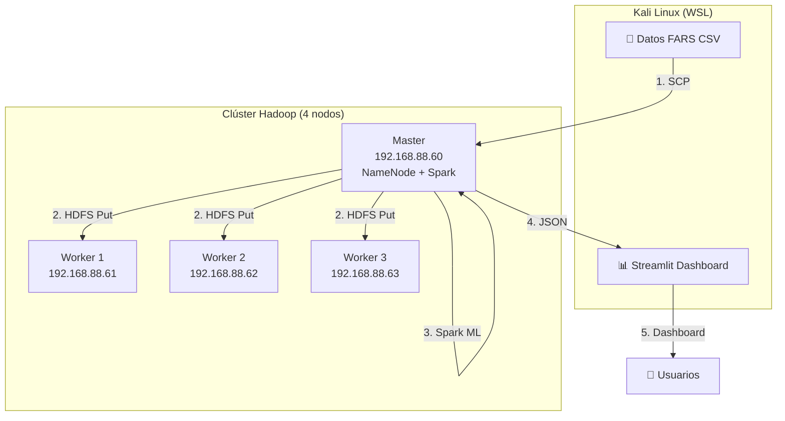

# 🚗 Big Data FARS — Pipeline Completo Hadoop + Spark + Streamlit

> **Repositorio:** [github.com/Triluxxx/big_data](https://github.com/Triluxxx/big_data)

---

## 📂 Estructura del Repositorio

| Archivo | Contenido | ¿Para quién? |
|---------|-----------|---------------|
| **[CASO_DE_ESTUDIO_FARS.md](CASO_DE_ESTUDIO_FARS.md)** | 📄 Documento formal del caso: pipeline, arquitectura, resultados, recomendaciones | Profesor, empresa, informe |
| **[COMANDOS.md](COMANDOS.md)** | ⚡ Todos los comandos en orden del flujo de trabajo + 13 errores documentados | Replicación, referencia técnica |
| **[procedimiento_hadoop_fars.md](procedimiento_hadoop_fars.md)** | 🐘 Documentación técnica exhaustiva del clúster Hadoop, Spark, HDFS | Documentación del proyecto |

### 📂 Archivos de Código

| Archivo | Descripción |
|---------|-------------|
| `analisis_correlacion_v2.py` | Script PySpark — correlación Pearson + Random Forest Regressor |
| `dashboard_fars_v2.py` | Dashboard Streamlit ejecutivo con hallazgos del análisis |
| `dashboard_fars_master.py` | Versión del dashboard para ejecutar directo en el master |
| `resultados_analisis.json` | Resultados del modelo en formato JSON |

### 📂 Datos

| Archivo | Registros | Tamaño |
|---------|-----------|--------|
| `fars-2015-accidents (1).csv` | 32,166 | 4.66 MB |
| `fars-2016-accidents.csv` | 34,748 | 5.60 MB |

---

## 🏗️ Arquitectura del Proyecto



---

## 🚀 Flujo de Trabajo (7 Fases)

| Fase | Descripción | Documento |
|------|-------------|-----------|
| 1 | Descubrimiento y diagnóstico del clúster | [COMANDOS.md Fase 1](COMANDOS.md#-fase-1-conectividad-y-diagnóstico) |
| 2 | Transferencia de datos Kali → Master | [COMANDOS.md Fase 2](COMANDOS.md#-fase-2-transferencia-de-datos-kali--master) |
| 3 | Carga a HDFS con particionado | [COMANDOS.md Fase 3](COMANDOS.md#-fase-3-carga-a-hdfs) |
| 4 | Instalación de Apache Spark 3.5.8 | [COMANDOS.md Fase 4](COMANDOS.md#-fase-4-instalación-de-apache-spark) |
| 5 | Análisis ML con PySpark | [COMANDOS.md Fase 5](COMANDOS.md#-fase-5-análisis-de-correlación-con-pyspark) |
| 6 | Dashboard ejecutivo con Streamlit | [COMANDOS.md Fase 6](COMANDOS.md#-fase-6-dashboard-streamlit) |
| 7 | Exposición pública con localtunnel | [COMANDOS.md Fase 7](COMANDOS.md#-fase-7-exposición-pública-túnel) |

---

## 📊 Resultados Clave

> **El alcohol tiene un efecto multiplicador:** un accidente con 3 conductores ebrios es **70% más letal** que uno sin alcohol.

| Factor | Impacto | Recomendación |
|--------|---------|---------------|
| 🍺 Conductores ebrios | 3 ebrios = +70% fatalidades | Alcolock en flotas |
| 💡 Oscuridad sin luz | 27.9% de accidentes | Auditoría de alumbrado |
| 🏙️ Zona urbana | +4.7% tasa vs rural | Intersecciones seguras |
| 🕐 Hora pico 17-21h | Mayor concentración | Operativos focalizados |

---

## 🔧 Stack Tecnológico

| Capa | Tecnología | Versión |
|------|-----------|---------|
| Almacenamiento | Hadoop HDFS | 3.3.6 |
| Procesamiento | Apache Spark | 3.5.8 |
| ML | Spark MLlib (Random Forest) | 3.5.8 |
| Lenguaje | Python (PySpark) | 3.13 |
| Visualización | Streamlit | 1.58 |
| Gráficos | Matplotlib | 3.11 |
| Datos | Pandas | 3.0 |
| Túnel | Localtunnel | - |

---

## 🔗 Dashboard

El dashboard se ejecuta localmente y se expone vía túnel:

```bash
# Iniciar dashboard
cd "/home/kali/big data"
streamlit run dashboard_fars_v2.py --server.port 8501

# Exponer públicamente
npx localtunnel --port 8501
```

---

## 📋 Errores Documentados (13)

Todos los errores encontrados durante el desarrollo están documentados con síntoma, causa y solución en:

- **[COMANDOS.md](COMANDOS.md#-resumen-de-errores-y-soluciones)** — Tabla resumen de los 13 errores
- **[procedimiento_hadoop_fars.md](procedimiento_hadoop_fars.md#6-errores-encontrados-y-soluciones)** — Documentación detallada de cada error

---

## 📝 Licencia

Proyecto académico — Big Data 2026.

---

*Para detalles completos, consultar [CASO_DE_ESTUDIO_FARS.md](CASO_DE_ESTUDIO_FARS.md).*
