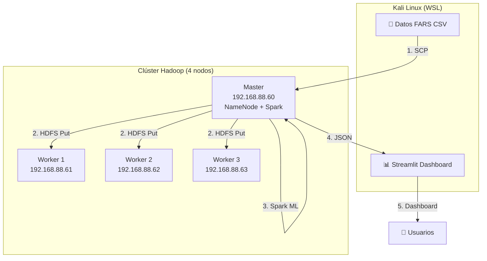

# 🚗 Big Data FARS — Pipeline Completo Hadoop + Spark + Streamlit

> **Repositorio:** [github.com/Triluxxx/big_data](https://github.com/Triluxxx/big_data)

---

## 📂 Estructura del Repositorio

| Archivo | Contenido | ¿Para quién? |
|---------|-----------|---------------|
| **[CASO_DE_ESTUDIO_FARS.md](CASO_DE_ESTUDIO_FARS.md)** | 📄 Documento formal del caso: pipeline, arquitectura, resultados, recomendaciones | Profesor, empresa, informe |
| **[COMANDOS.md](COMANDOS.md)** | ⚡ Todos los comandos en orden del flujo de trabajo + 13 errores documentados | Replicación, referencia técnica |
| **[procedimiento_hadoop_fars.md](procedimiento_hadoop_fars.md)** | 🐘 Documentación técnica exhaustiva del clúster Hadoop, Spark, HDFS | Documentación del proyecto |

### 📂 Archivos de Código

| Archivo | Descripción |
|---------|-------------|
| `resultados_analisis.json` | Resultados del modelo Spark ML en formato JSON |

> 💡 Los scripts Python (`scripts/`) y el dashboard (`dashboard_fars_v4.py`) están disponibles localmente. El código completo se encuentra documentado dentro de [COMANDOS.md](COMANDOS.md) y [CASO_DE_ESTUDIO_FARS.md](CASO_DE_ESTUDIO_FARS.md).

### 📂 Datos

| Archivo | Registros | Tamaño |
|---------|-----------|--------|
| `fars-2015-accidents (1).csv` | 32,166 | 4.66 MB |
| `fars-2016-accidents.csv` | 34,748 | 5.60 MB |

---

## 🏗️ Arquitectura del Proyecto



---

## 🚀 Flujo de Trabajo (4 Fases)

| Fase | Descripción | Documentado en |
|------|-------------|----------------|
| 1 | Descubrimiento y diagnóstico del clúster | [COMANDOS.md Fase 1](COMANDOS.md) |
| 2 | Transferencia y carga a HDFS con particionado | [COMANDOS.md Fase 2-3](COMANDOS.md) |
| 3 | Análisis ML con PySpark (Pearson + Random Forest) | [COMANDOS.md Fase 5](COMANDOS.md) |
| 4 | Dashboard ejecutivo con Streamlit + Plotly | [COMANDOS.md Fase 6](COMANDOS.md) |

---

## 📊 Resultados Clave

> **El alcohol tiene un efecto multiplicador:** un accidente con 3 conductores ebrios es **70% más letal** que uno sin alcohol.

| Factor | Impacto | Recomendación |
|--------|---------|---------------|
| 🍺 Conductores ebrios | 3 ebrios = +70% fatalidades | Alcolock en flotas |
| 💡 Oscuridad sin luz | 27.9% de accidentes | Auditoría de alumbrado |
| 🏙️ Zona urbana | +4.7% tasa vs rural | Intersecciones seguras |
| 🕐 Hora pico 17-21h | Mayor concentración | Operativos focalizados |

---

## 🔧 Stack Tecnológico

| Capa | Tecnología | Versión |
|------|-----------|---------|
| Almacenamiento | Hadoop HDFS | 3.3.6 |
| Procesamiento | Apache Spark | 3.5.8 |
| ML | Spark MLlib (Random Forest) | 3.5.8 |
| Lenguaje | Python (PySpark) | 3.13 |
| Visualización | Streamlit + **Plotly** | 1.58 |
| Gráficos | Plotly (interactivos) | 5.x |
| Datos | Pandas | 3.0 |
| Túnel | Localtunnel | - |

---

## 🔗 Dashboard

El código del dashboard y los scripts modulares están documentados en [COMANDOS.md](COMANDOS.md).

```bash
# El dashboard se ejecuta localmente:
streamlit run dashboard_fars_v4.py --server.port 8501

# Pipeline completo:
python3 scripts/pipeline_completo.py
```

---

## 📋 Errores Documentados (13)

Todos los errores encontrados durante el desarrollo están documentados con síntoma, causa y solución en:

- **[COMANDOS.md](COMANDOS.md#-resumen-de-errores-y-soluciones)** — Tabla resumen de los 13 errores
- **[procedimiento_hadoop_fars.md](procedimiento_hadoop_fars.md#6-errores-encontrados-y-soluciones)** — Documentación detallada de cada error

---

## 📝 Licencia

Proyecto académico — Big Data 2026.

---

*Para detalles completos, consultar [CASO_DE_ESTUDIO_FARS.md](CASO_DE_ESTUDIO_FARS.md).*
